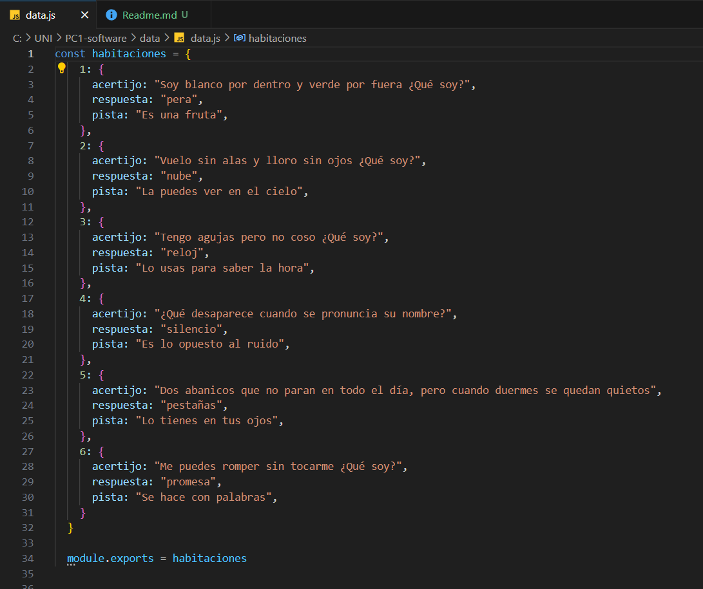
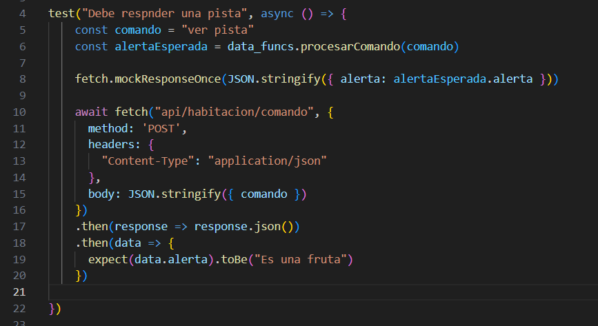
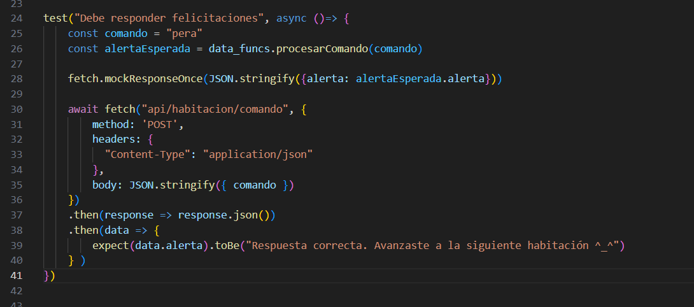

# Informe acerca de el trabajo realizado
Vamos a desarrollar un juego de "Esacape ROOM" donde los jugadores deben resolver una serie de acertijos para escapar de un habitación virtual
El juego consiste en habitaciones secuenciales, donde vamos a ir agregando paso a paso cada funcionalidad

# Configuración de CI.yml
  
    
# BACKEND  
  
## 1: Módulo Data  
No se usó niguna base de datos, en vez de eso, para almacenar las habitaciones con sus acertijos, respuesta y pista creamos un objeto en el script `data.js` que los contenia de la siguiente manera:  
  
  
Se va a poder interactuar con esos datos con dos funciones, estas están en el script `data_func.js`.   
  
Una de esas funciones se llama `getHabitacionActual()` que básicamente devuelve la tanto la habitación en que se encuentra el jugador y su acertijo respectivo.  

   
  
La otra función `procesarComando()` recibe como parámetro el comando digitado por el usuario desde el frontend y aqui procesamos una respuesta que devolverá la función en base al comando digitado:  
  
  
  
## 2. Módulo src  
Dependencias a tener en cuenta:   
-Usamos `express` para construir nuestra api.  
-Usamos `body-parser` que nos ayuda a procesar el cuerpo de las solicitudes entrantes que tienen formato Json.  
  
Todo eso lo instalamos con
```
npm install expree body-parser
```  
Y en el `package.json` en la sección de dependencies aparece dichas dependencias instaladas:  
```
     "dependencies": {
        "body-parser": "^1.20.3",
        "express": "^4.21.0",
     }
```    
  
El archivo app configuramos los middleware, y lo lanzamos en el puerto 3000, además montamos un conjunto de rutas bajo el prefijo api (ver linea 11 de la imágen):  
  
  
 
En el archivo `routes.js` es donde se definen los 2 endpoints que utilizarán las funciones definidas del modulo data (`data/data_func.js`) y enviar una respuesta al frontend para que las renderize en el dom y lo muestre al usuario.  
  
  
  
## 3. Módulo test  
Para los test usamos jest y una dependencia llamada `jest-fetch-mock`, como su nombre lo indica es un mock de fetch que nos ayudará a definir respuestas que debería devolver la api al hacer algun request utilizando el método `mockResponseOnce()`.  
La instalación de esta dependecia se hace mendiante:  
```
    npm install jest-fetch-mock
```
  
1. El primer test es para verificar que la api esta respondiendo al comando `ver pista`, por defecto se comienza en la habitación uno y la pista esperada es "Es una fruta", lo que se hace es verificar que la api devuelva eso  
  
  
   
2. El segundo test es para verificar que se muestra el mensaje de "Respuesta correcta" cuando se responde bien al acertijo, el fecth se hace con un método POST pues con este se envía datos al servidor (api), en este caso es el comando, como por defecto primero se tiene el primer acertijo entonces al responder con `pera` debería mostrarse el mensaje de respuesta correcta, y eso lo verifica el test:  
  

