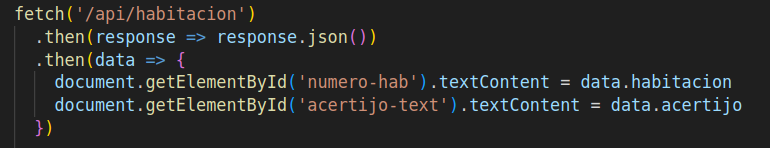
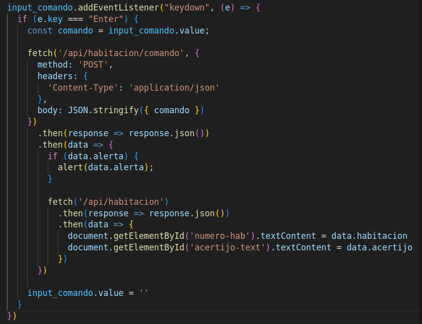
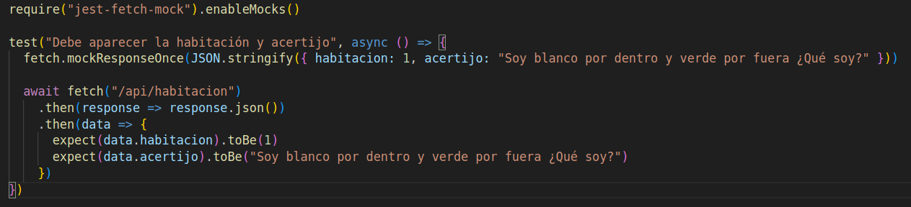

 ## 1: SCRIPT
  Implementamos un codigo `script.js` que va interactuar con nuestra API para actulizar nuestra pagina web del juego, cada vez que se realize una peticion.

  Utilizamos la funcion de `fecth` de JavaScript para hacer solicitudes al servidor y manejar las respuestas. `fecth('/api/habitacion')` realiza una solicitud GET para obtener de la API, la informacion de la habitacion actual y su respectivo acertijo.
  

  Capturamos la respuesta introducida por el jugador y añadimos un `listener` para que introduzca su respuesta y presiona una tecla especifica tenga un resultado.
  
  Este `listener` utiliza una funcion `fecth` para una solicitud POST para mostrar el resultado dado la respuesta enviada y capturada anteriormente.  
  Asimismo, de acuerdo la respuesta fue correcta o no, actualizaremos mediante otro `fecth` para obtener la informacion de la siguiente habitacion o simplemente quedarnos en la misma.
  

## 2: TEST  
 Para el testeo utilizamos `jest` y la dependencia llamada `jest-fecth-mock`, un mock de fecth para que nos ayude a definir respuestas sin acceder directamente al servidor con solicitudes.  
 El test es para ver cuando se hace una solicitud a traves de `fecth()` dado un numero de habitacion y artijo arbitrario, devuelva mediante otro `fecth()` de una solicitud GET, sea los datos correspodientes que los datos arbitrarios.
 