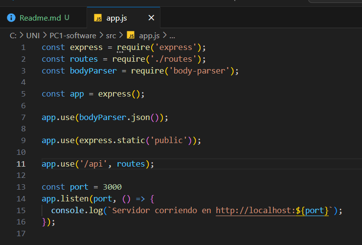
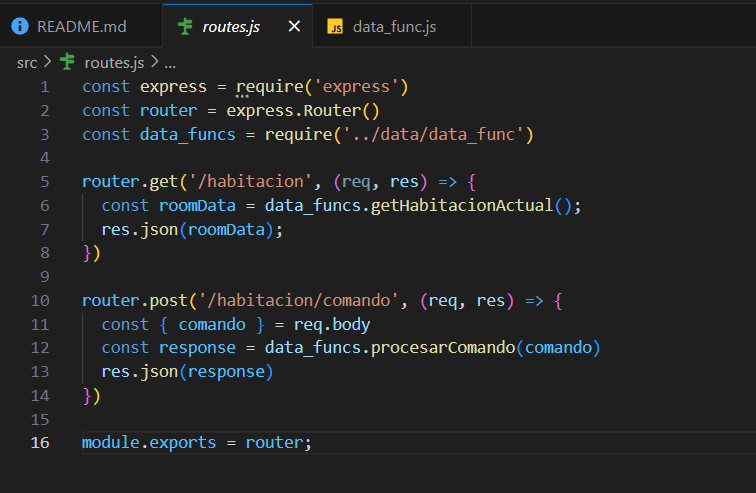
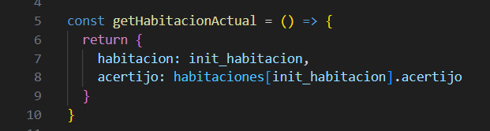
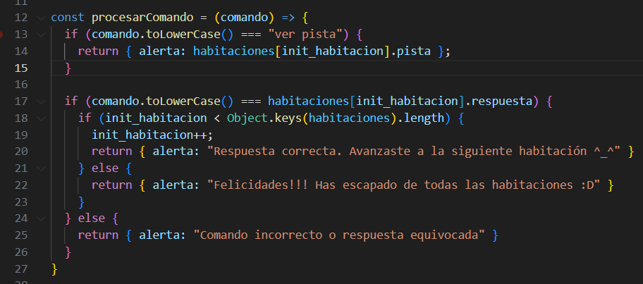

# PARTE 2:  
## 1. Resolución de acertijos mediante la API REST 
El archivo app configuramos los middleware, y lo lanzamos en el puerto 3000, además montamos un conjunto de rutas bajo el prefijo api (ver linea 11 de la imágen)
  

En routes estan los dos endpoints:  
1. endpoint: `/habitacion`: Sirve para obtener la habitación en que se encuentra el jugador y el acertijo respectivo, y lo mandamos como JSON para que le frontend lo consuma, es decir lo muestre en el DOM (en el navegador)  
  
2. endpoint: `/habitacion/comando`:  este enpoint procesa el comando que el usuario digita, y dependiendo de eso responderá con un mensaje.
  
  
Hemos visto que se uso ciertas funciones como `getHabitacionActual()`  
En data.js tenemos un objeto donde almacena cada habitación y su respectivo acertijo, entonces esta función retorna un objeto con la habitación y acertijo
    
  
El 2do endpoint usa la función `procesarComando()` lo que hace es tomar el comando como parametro y enviar un mensaje respectivo para que en el frontend lo muestere como alert  

  